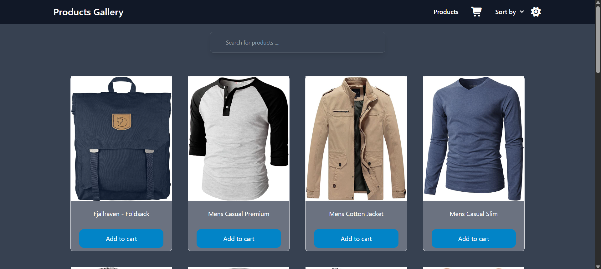
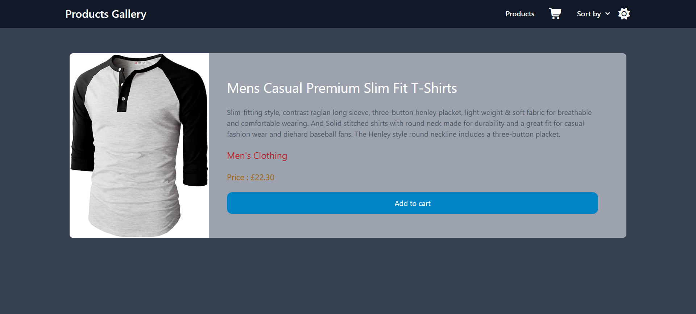
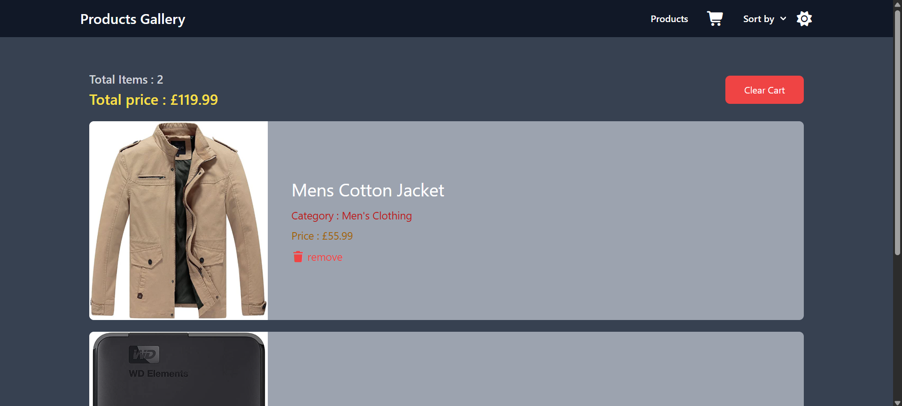

# products-gallery

# 🛍️ Products Gallery Web App (Angular)

A fully functional, responsive products gallery web application built with **Angular 17** and **Tailwind CSS v3**, using the **Fake Store API**.  
Users can browse products, filter by title, sort by price, and manage their shopping cart — offering a smooth e-commerce-like experience.

---

## 📸 Screenshots

| Products Page                        | Product Details                     | Cart Page                        |
| ------------------------------------ | ----------------------------------- | -------------------------------- |
|  |  |  |

---

## 🚀 Live Demo

[🔗 View Live App](https://product-gallery1.netlify.app)

---

## 🧰 Tech Stack Used

- **Angular 17**
- **Tailwind CSS v3**
- **Angular Router**
- **RxJS**
- **HttpClient**
- **Fake Store API**
- **LocalStorage**
- **Flowbite** (UI Components)
- **ngx-toastr** (Toast Notifications)
- **ngx-spinner** (Loading Indicators)

---

## ✨ Features

- ✅ Fully responsive design with **dark mode support**
- ✅ Browse and display products from Fake Store API
- ✅ Filter products by title
- ✅ Sort products by name (A-Z)
- ✅ Sort products by price (Low to High, High to Low)
- ✅ Real-time search by product title
- ✅ Product details page
- ✅ Shopping cart with:
  - Add to cart
  - Remove from cart
  - Calculate total price and total items
  - Store cart state in `localStorage`
- ✅ Toast notifications for actions & errors
- ✅ Loading spinners during API calls
- ✅ Global error handling with interceptor fallback

---
